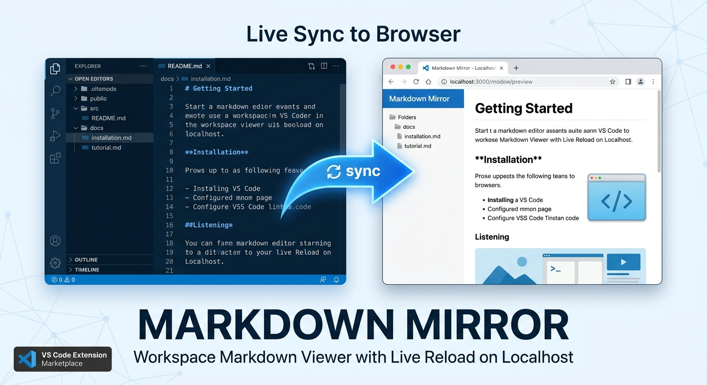

# Markdown Mirror



## Author

Sai Teja Nagamothu  
[](https://github.com/saiteja21)
[](https://www.linkedin.com/in/saiteja-n/)

Live Markdown preview for your full VS Code workspace with instant browser updates, file explorer navigation, Mermaid diagrams, KaTeX math, TOC, slides, and export tools to pdf, MS word.

Perfect for docs-driven teams, technical writers, and engineers who want a docs-site style workflow directly from local markdown files.

## Why Markdown Mirror

Markdown Mirror gives you a docs-site feeling directly from your VS Code workspace.
It scans markdown files, serves a mirrored structure, and updates the browser preview on every keystroke or save.

## Features

- Modern browser UI with workspace explorer and rich markdown renderer
- Full-width rendering by default with persistent reading-width toggle
- Side-by-side compare mode (open two markdown docs simultaneously)
- TOC sidebar for heading-based navigation in the active pane
- Light/Dark preview theme toggle
- Print / PDF export via browser print flow
- KaTeX math rendering (configurable)
- Word/character count and reading-time stats bar
- Keyboard shortcuts for fast navigation and actions
- Heading anchor links for deep-linking sections
- Mermaid theme control via settings
- Editor/browser scroll sync
- Slide mode for `---` separated sections
- Export current document to standalone HTML
- Interactive task list checkbox toggles
- YAML frontmatter card rendering
- Tabs for recently opened documents
- Image lightbox/zoom
- Favorites (pinned files) in sidebar
- Back-to-top quick action
- Internal markdown link validation
- Custom CSS injection from workspace
- Multi-workspace visual markers + sidebar file count
- Auto-starts on markdown workspaces (configurable)
- WebSocket hot updates (no full-page refresh flicker)
- Relative image path support through local asset mapping
- Mermaid diagram rendering for fenced `mermaid` code blocks
- Download Mermaid diagrams as PNG from browser
- Syntax highlighting with `markdown-it` + `highlight.js`
- Localhost-only server guard (`127.0.0.1`)

## Commands

- `Markdown Mirror: Start`
- `Markdown Mirror: Stop`

## Use In VS Code

### Open Mirror From Command Palette

<table>
	<thead>
		<tr>
			<th>Step</th>
			<th>Action</th>
		</tr>
	</thead>
	<tbody>
		<tr>
			<td>1</td>
			<td>Open Command Palette.</td>
		</tr>
		<tr>
			<td>2</td>
			<td>Use shortcut: Windows/Linux <code>Ctrl+Shift+P</code>, macOS <code>Cmd+Shift+P</code>.</td>
		</tr>
		<tr>
			<td>3</td>
			<td>Run <code>Markdown Mirror: Start</code>.</td>
		</tr>
		<tr>
			<td>4</td>
			<td>A local server URL appears (for example <code>http://127.0.0.1:51315</code>).</td>
		</tr>
		<tr>
			<td>5</td>
			<td>Browser should open automatically based on your settings.</td>
		</tr>
	</tbody>
</table>

If browser does not open, copy the URL from the notification and open it manually.

### Close Mirror

1. Open Command Palette:
	- Windows/Linux: `Ctrl+Shift+P`
	- macOS: `Cmd+Shift+P`
2. Run `Markdown Mirror: Stop`.

This stops the local server for the current VS Code session.

### Configure Settings In VS Code

1. Open Settings UI:
	- Windows/Linux: `Ctrl+,`
	- macOS: `Cmd+,`
2. Search for `Markdown Mirror`.
3. Configure:
	- `markdownMirror.autoStart`
	- `markdownMirror.autoOpenMode`
	- `markdownMirror.rootPath`
	- `markdownMirror.enableMath`
	- `markdownMirror.mermaidTheme`
	- `markdownMirror.showFrontmatter`
	- `markdownMirror.customCssPath`

You can also open Settings (JSON) and set values directly.

Default behavior (recommended for most users):

- Leave `markdownMirror.rootPaths` empty.
- Markdown Mirror uses the currently open workspace root and discovers all markdown files under it.

Example (default behavior):

```json
{
	"markdownMirror.autoStart": true,
	"markdownMirror.autoOpenMode": "always"
}
```

Optional scoped-folder example (only if you want to limit discovery):

- Set `markdownMirror.rootPaths` to one or more folders relative to your workspace root.
- Example below scans `<workspace>/ProjectDocs` and `<workspace>/TeamNotes`.

```json
{
	"markdownMirror.rootPaths": [
		"ProjectDocs",
		"TeamNotes"
	]
}
```

Backward compatibility:

- `markdownMirror.rootPath` still works as a legacy fallback when `markdownMirror.rootPaths` is empty.
- If `markdownMirror.rootPaths` is explicitly set (including `[]`), it takes precedence and legacy `rootPath` is ignored.

Path format rules:

- Paths are relative to the root folder of each workspace folder (for example `ProjectDocs`, `guides/release-notes`, `knowledge/base`).
- Do not use absolute paths (for example `C:/repo/docs` or `/repo/docs`).
- Do not use path traversal segments (`..` or `.`).
- In multi-root workspaces, each entry is resolved inside each workspace folder.
- You can set these in **User** settings for global defaults, then override in **Workspace** or workspace-folder settings when needed.
- Default setting: `markdownMirror.rootPaths` is empty (`[]`), which means scan all markdown files under each workspace folder.
- If configured paths are missing in a workspace folder, Markdown Mirror falls back to scanning that workspace folder root.

## Settings

- `markdownMirror.autoStart`
	- `true` (default): auto-start mirror when markdown files are present in workspace.
- `markdownMirror.autoOpenMode`
	- `always`: open browser on every auto-start.
	- `firstRun` (default): open browser only on first auto-start for this machine/profile.
	- `never`: do not auto-open browser on auto-start.
- `markdownMirror.enableMermaid`
	- `true` (default): render Mermaid diagrams from markdown code fences.
- `markdownMirror.htmlMode`
	- `safe` (default): sanitize rendered HTML.
	- `trusted`: allow raw HTML from markdown without sanitization (trusted content only).
- `markdownMirror.rootPath`
	- Legacy single-path fallback.
	- Used only when `markdownMirror.rootPaths` is empty.
	- Relative path only; absolute paths and traversal segments are ignored.
- `markdownMirror.rootPaths`
	- Empty (default): use the currently open workspace root and scan all markdown files.
	- Array of relative paths (for example `["docs", "notes"]`): only render markdown tree from those folders.
	- Relative paths only; absolute paths and traversal segments are ignored.
- `markdownMirror.enableMath`
	- `true` (default): enable KaTeX rendering for inline and block math.
	- `false`: disable math rendering.
- `markdownMirror.mermaidTheme`
	- `default` (default): uses Mermaid default in light mode and dark in dark mode.
	- `dark`: always use Mermaid dark theme.
	- `forest`: always use Mermaid forest theme.
	- `neutral`: always use Mermaid neutral theme.
- `markdownMirror.showFrontmatter`
	- `card` (default): render YAML frontmatter as a collapsible metadata card.
	- `none`: do not display frontmatter card.
- `markdownMirror.customCssPath`
	- Empty (default): use built-in styles only.
	- Relative path (for example `docs/preview.css`): inject custom CSS from workspace into preview.
- `markdownMirror.offlineMode`
	- `true` (default): block external HTTP/HTTPS resources in preview/export flows.
- `markdownMirror.defaultCompareMode`
	- `true` (default): open preview in compare mode for new browser sessions.
- `markdownMirror.defaultTocVisible`
	- `true` (default): show TOC panel by default for new browser sessions.
- `markdownMirror.defaultTheme`
	- `light` (default): start preview in light mode.
	- `dark`: start preview in dark mode.
- `markdownMirror.defaultWidthMode`
	- `full` (default): start with full-width content.
	- `reading`: start with reading-width content.
- `markdownMirror.enablePrint`
	- `true` (default): show Print / PDF action.
- `markdownMirror.enableHtmlExport`
	- `true` (default): show Export HTML action.
- `markdownMirror.enableWordExport`
	- `true` (default): show Export Word action.
- `markdownMirror.enableSlides`
	- `true` (default): show Slides mode action.
- `markdownMirror.enableCompare`
	- `true` (default): show Compare mode action.
- `markdownMirror.enableToc`
	- `true` (default): show TOC panel toggle.
- `markdownMirror.enableThemeToggle`
	- `true` (default): show Light/Dark theme toggle.
- `markdownMirror.enableWidthToggle`
	- `true` (default): show Reading/Full width toggle.

Manual command start always opens the browser.

## Security

- HTTP server listens on `127.0.0.1`.
- Requests from non-loopback addresses are rejected.
- Asset requests are workspace-bounded to prevent path traversal.

## Licensing And Third-Party Compliance

Markdown Mirror follows a local-first policy for implementation, but uses third-party libraries where they are the most practical and secure choice.

- Third-party notices and attributions: see [THIRD_PARTY_NOTICES.md](THIRD_PARTY_NOTICES.md).
- Release-time legal checklist: see [docs/release-legal-checklist.md](docs/release-legal-checklist.md).

Release policy:

- Prefer first-party implementation when practical.
- Use third-party components only with clear value.
- Before release, verify all required notices and license obligations are included.

## Quick Start

1. Install the extension from the VS Code Marketplace.
2. Open a workspace that contains `.md` files.
3. Extension auto-starts (if enabled) and opens your browser based on `autoOpenMode`.
4. Click any markdown file in the left explorer.
5. Edit markdown in VS Code and see live updates in browser.
6. Use topbar controls for Compare, TOC, Slides, Export HTML, theme, and Reading Width.

## Keyboard Shortcuts

- `/` Focus search
- `j` / `k` Move through files
- `Enter` Open focused file
- `[` / `]` Open previous/next file
- `t` Toggle TOC panel
- `d` Toggle light/dark theme
- `p` Print / Export to PDF
- `?` Show shortcuts help

## Troubleshooting

- Math not rendering:
	- Confirm `markdownMirror.enableMath` is enabled in VS Code Settings.
	- Use standard delimiters: inline `$E = mc^2$`, block `$$\int_0^1 x^2\,dx = \frac{1}{3}$$`.
	- If needed, run `Markdown Mirror: Stop` and then `Markdown Mirror: Start`.
- Mermaid not rendering:
	- Confirm `markdownMirror.enableMermaid` is enabled.
	- Ensure fenced block language is exactly `mermaid`.
- Browser page looks stale:
	- Refresh the browser tab once.
	- Verify VS Code has write access to the workspace files.
