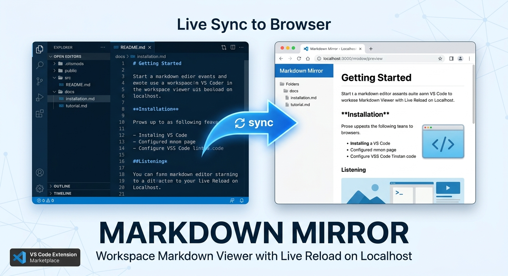

# Markdown Mirror



<p align="center">
<strong>Your workspace docs, beautifully rendered. Zero config.</strong>
</p>

<p align="center">
<a href="https://marketplace.visualstudio.com/items?itemName=ForkedCode.markdown-mirror"></a>
<a href="https://marketplace.visualstudio.com/items?itemName=ForkedCode.markdown-mirror"></a>

</p>

<p align="center">
<em>Live preview · Workspace explorer · Diagrams · Math · Search · Export · Quality tools</em>
</p>

---

Markdown Mirror turns your VS Code workspace into a live documentation site. Open any folder with markdown files and get an instant, navigable preview — inside VS Code or in your browser — that updates on every keystroke.

Built for **docs-driven teams**, **technical writers**, and **engineers** who want a polished reading experience without leaving their editor.

## ⚡ Quick Start

```
1. Install from the VS Code Marketplace
2. Open a workspace with .md files
3. Preview appears automatically — start writing
```

That's it. No config files, no build step, no deploy. Markdown Mirror auto-discovers your files and starts a local preview server.

> **Tip:** Use `Ctrl+Shift+P` → `Markdown Mirror: Start` if auto-start is disabled.

## ✨ What You Get

### 📖 Rich Rendering

| Feature | Details |
|---------|---------|
| **Markdown** | Full CommonMark + GFM with syntax highlighting via `highlight.js` |
| **Mermaid diagrams** | Flowcharts, sequence, Gantt, ER, and more — with PNG download |
| **PlantUML diagrams** | UML class, sequence, activity — rendered via configurable server |
| **KaTeX math** | Inline `$...$` and block `$$...$$` expressions |
| **YAML/JSON viewer** | Tree + source views with toggle, auto-detected from file extensions |
| **OpenAPI specs** | Structured API documentation auto-detected from OpenAPI 3.x files |
| **Frontmatter cards** | YAML frontmatter rendered as collapsible metadata cards |
| **Callouts & admonitions** | `> [!NOTE]`, `> [!WARNING]`, etc. |
| **Wiki links** | `[[page]]` style cross-references |
| **Task checkboxes** | Interactive — click to toggle, writes back to source file |
| **Content transclusion** | `<!-- include: path/to/file.md -->` pulls in content from other files |

### 🗂️ Workspace Navigation

- **File explorer sidebar** with full folder tree and file counts
- **Full-text search** across all workspace files (`/` to focus)
- **Tag cloud** — browse and filter by frontmatter tags
- **Table of contents** panel for heading-based navigation
- **Tabs** for recently opened documents
- **Favorites** — pin frequently used files
- **Backlinks** — see which files link to the current document
- **Find Heading** — jump to any heading across the workspace

### 🔄 Live Preview

- **WebSocket hot reload** — changes appear instantly, no page refresh
- **Scroll sync** — editor and preview scroll together
- **Side-by-side compare** — open two documents simultaneously
- **Rendered diff** — visually compare current file with its last git commit
- **Light/dark theme** toggle with VS Code theme sync in native mode
- **Reading width** vs full-width toggle
- **Focus mode** — distraction-free reading
- **Image lightbox** — click to zoom

### 📤 Export

| Format | How |
|--------|-----|
| **PDF** | Print flow with optimized layout |
| **HTML** | Standalone file with inlined styles and Mermaid SVGs |
| **Word (.docx)** | One-click export |
| **HTML with profiles** | Web, Review, or Print — tailored export styles |
| **Workspace bundle** | Compose multiple docs into a single HTML |

### 🛡️ Quality & Maintenance

- **Document audit** — readability, structure, and style checks
- **Workspace audit** — scan all files at once
- **Quality dashboard** — visual overview at `/dashboard` in browser
- **Internal link validation** — find broken `[text](path)` references
- **External link checker** — verify URLs return 200 (HEAD/GET with redirect following)
- **Auto-fix links on rename** — move or rename a `.md` file, all references update automatically
- **Quality diagnostics** — optional Problems panel integration

### 🌐 Sharing & Collaboration

- **Dev Tunnel sharing** — share your live preview with teammates over the internet
- **Slide mode** — present `---`-separated sections as a slideshow
- **Keyboard shortcuts** — navigate, search, and act without touching the mouse

## 🖥️ Preview Modes

| Mode | Setting | Description |
|------|---------|-------------|
| **Native** | `"vscode"` (default) | Preview inside a VS Code panel — theme syncs automatically |
| **Browser** | `"browser"` | Full-featured UI in your default browser |
| **Both** | `"both"` | Native panel + browser simultaneously |

Set via `markdownMirror.hostMode` in VS Code settings.

## 🎹 Keyboard Shortcuts

| Key | Action |
|-----|--------|
| `/` | Focus search |
| `j` / `k` | Navigate file list |
| `Enter` | Open focused file |
| `[` / `]` | Previous / next file |
| `t` | Toggle TOC panel |
| `d` | Toggle light/dark theme |
| `p` | Print / Export to PDF |
| `?` | Show all shortcuts |

## 🎯 Commands

All commands are available via `Ctrl+Shift+P` (or `Cmd+Shift+P` on macOS):

| Command | Description |
|---------|-------------|
| `Markdown Mirror: Start` | Start the preview server and open preview |
| `Markdown Mirror: Open Preview` | Open native VS Code preview panel |
| `Markdown Mirror: Stop` | Stop the preview server |
| `Markdown Mirror: Preview Active File` | Jump to current editor file in preview |
| `Markdown Mirror: Export HTML` | Export current document as standalone HTML |
| `Markdown Mirror: Export HTML with Profile` | Export with Web / Review / Print profile |
| `Markdown Mirror: Export to Word` | Export current document as .docx |
| `Markdown Mirror: Print / PDF` | Print or save as PDF |
| `Markdown Mirror: Compare Mode` | Side-by-side two-document view |
| `Markdown Mirror: Compare with Git (Rendered Diff)` | Visual diff against last git commit |
| `Markdown Mirror: Slides Mode` | Present sections as slides |
| `Markdown Mirror: Review Document` | Run quality audit on current file |
| `Markdown Mirror: Review Workspace` | Run quality audit across all files |
| `Markdown Mirror: Validate Links` | Check internal markdown links |
| `Markdown Mirror: Check External Links` | Verify external URLs are reachable |
| `Markdown Mirror: Show Backlinks` | Find files that reference current file |
| `Markdown Mirror: Find Heading` | Jump to any heading in workspace |
| `Markdown Mirror: Toggle Focus Mode` | Distraction-free reading mode |
| `Markdown Mirror: Compose Bundle` | Combine multiple docs into one HTML |
| `Markdown Mirror: Share via Dev Tunnel` | Share preview over the internet |
| `Markdown Mirror: Toggle Setting` | Quick-toggle any Mirror setting |
| `Markdown Mirror: Copy Server URL` | Copy the local server URL |
| `Markdown Mirror: Refresh Files` | Refresh the file tree |
| `Markdown Mirror: Refresh TOC` | Refresh the table of contents |
| `Markdown Mirror: Review Mode` | Open in review-optimized layout |

## ⚙️ Settings

Search `Markdown Mirror` in VS Code Settings, or edit `settings.json` directly.

### Core

| Setting | Default | Description |
|---------|---------|-------------|
| `autoStart` | `true` | Auto-start when markdown workspace opens |
| `autoOpenMode` | `"firstRun"` | `"always"` / `"firstRun"` / `"never"` — controls browser auto-open |
| `hostMode` | `"vscode"` | `"vscode"` / `"browser"` / `"both"` |
| `port` | `0` | Fixed port (0 = auto-assign). Use fixed port for dev tunnels |

### Content Scoping

| Setting | Default | Description |
|---------|---------|-------------|
| `rootPaths` | `[]` | Folder paths to scan (empty = entire workspace) |
| `excludePaths` | `[]` | Paths or globs to exclude from the tree |
| `defaultFilePath` | `""` | Auto-open this file on launch (e.g., `"README.md"`) |
| `startExplorerCollapsed` | `false` | Start with sidebar collapsed |

### Rendering

| Setting | Default | Description |
|---------|---------|-------------|
| `enableMath` | `true` | KaTeX math rendering |
| `enableMermaid` | `true` | Mermaid diagram rendering |
| `enablePlantUml` | `false` | PlantUML rendering (opt-in — calls external server) |
| `plantUmlServer` | `"https://www.plantuml.com/plantuml"` | PlantUML server URL |
| `showFrontmatter` | `"card"` | `"card"` or `"none"` |
| `mermaidTheme` | `"default"` | `"default"` / `"dark"` / `"forest"` / `"neutral"` |
| `htmlMode` | `"safe"` | `"safe"` (sanitized) or `"trusted"` (raw HTML allowed) |
| `enableTransclusion` | `true` | Enable `<!-- include: path -->` directives |
| `enableDataFiles` | `true` | Show YAML/JSON files in explorer with rich preview |
| `dataFileExtensions` | `[".yaml", ".yml", ".json"]` | File types treated as data files |
| `enableSearch` | `true` | Full-text search in browser preview |

### Appearance

| Setting | Default | Description |
|---------|---------|-------------|
| `defaultTheme` | `"light"` | Initial theme for new sessions |
| `defaultWidthMode` | `"full"` | `"full"` or `"reading"` width |
| `defaultCompareMode` | `false` | Start in compare mode |
| `defaultTocVisible` | `true` | Show TOC panel on load |
| `customCssPath` | `""` | Workspace-relative CSS file to inject |
| `nativeFollowVsCodeTheme` | `true` | Native preview mirrors VS Code theme |
| `nativeLockThemeToggle` | `true` | Lock theme toggle when syncing with VS Code |
| `nativeUiProfile` | `"focused"` | `"focused"` (minimal) or `"classic"` (full UI) |

### Feature Toggles

| Setting | Default | Description |
|---------|---------|-------------|
| `enablePrint` | `true` | Show Print / PDF action |
| `enableHtmlExport` | `true` | Show Export HTML action |
| `enableWordExport` | `true` | Show Export Word action |
| `enableSlides` | `true` | Show Slides mode action |
| `enableCompare` | `true` | Show Compare mode action |
| `enableToc` | `true` | Show TOC panel toggle |
| `enableThemeToggle` | `true` | Show theme toggle |
| `enableWidthToggle` | `true` | Show width toggle |

### Quality & Maintenance

| Setting | Default | Description |
|---------|---------|-------------|
| `enableQualityDiagnostics` | `false` | Show quality issues in Problems panel |
| `enableExternalLinkCheck` | `true` | Enable external URL verification |
| `autoFixLinksOnRename` | `true` | Auto-update links when files are renamed/moved |
| `maxLineLength` | `0` | Line length limit for quality checks (0 = disabled) |
| `offlineMode` | `true` | Block external resources in preview |

### Minimal Config Example

```json
{
  "markdownMirror.autoStart": true,
  "markdownMirror.hostMode": "vscode"
}
```

### Scoped Folders Example

```json
{
  "markdownMirror.rootPaths": ["docs", "specs"],
  "markdownMirror.excludePaths": ["drafts", "**/archive"]
}
```

## 🔒 Security

- Preview server binds to `127.0.0.1` only — never exposed to the network
- All asset requests are workspace-bounded to prevent path traversal
- HTML sanitization enabled by default (`htmlMode: "safe"`)
- Offline mode blocks external resource loading by default
- PlantUML rendering is opt-in (disabled by default) since it calls an external server

## 🐛 Troubleshooting

<details>
<summary><strong>Math not rendering</strong></summary>

- Confirm `markdownMirror.enableMath` is `true`
- Use standard delimiters: `$E = mc^2$` for inline, `$$\int_0^1 x^2\,dx$$` for block
- Restart: `Markdown Mirror: Stop` → `Markdown Mirror: Start`
</details>

<details>
<summary><strong>Mermaid diagrams not appearing</strong></summary>

- Confirm `markdownMirror.enableMermaid` is `true`
- Use fenced code blocks with `mermaid` language, or Azure DevOps `:::mermaid` syntax
</details>

<details>
<summary><strong>PlantUML diagrams not rendering</strong></summary>

- Enable via `markdownMirror.enablePlantUml: true` (off by default)
- Requires network access to the PlantUML server (default: `plantuml.com`)
- Won't work when `offlineMode` is `true`
- For private servers, set `markdownMirror.plantUmlServer` to your server URL
</details>

<details>
<summary><strong>Preview looks stale or frozen</strong></summary>

- Run `Developer: Reload Window`
- Verify VS Code has write access to workspace files
- Check that the server is running (look for the Markdown Mirror status bar item)
</details>

<details>
<summary><strong>External link check shows false positives</strong></summary>

- Some sites block automated requests — results are cached to reduce noise
- Disable with `markdownMirror.enableExternalLinkCheck: false`
</details>

## 📜 License

MIT — see [LICENSE](LICENSE) for details.

Third-party notices: [THIRD_PARTY_NOTICES.md](THIRD_PARTY_NOTICES.md) · Legal checklist: [docs/release-legal-checklist.md](docs/release-legal-checklist.md)

## 👤 Author

**Sai Teja Nagamothu**
[](https://github.com/saiteja21)
[](https://www.linkedin.com/in/saiteja-n/)

---

<p align="center">
<strong>If Markdown Mirror helps your workflow, <a href="https://marketplace.visualstudio.com/items?itemName=ForkedCode.markdown-mirror&ssr=false#review-details">leave a review on the Marketplace</a> ⭐</strong>
</p>
