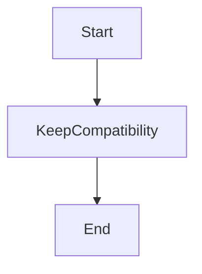

# Azure DevOps Mermaid Container Test

This file validates Azure DevOps Mermaid container compatibility.

Expected:
- Diagram renders from :::mermaid syntax.
- Diagram renders from ::: mermaid syntax.
- Existing fenced mermaid still renders.

## Container syntax without space

:::mermaid
sequenceDiagram
    participant User
    participant Renderer
    User->>Renderer: Parse container syntax
    Renderer-->>User: Render Mermaid diagram
:::

## Container syntax with space

::: mermaid
graph LR
    A[Container Open] --> B[Mermaid Body]
    B --> C[Container Close]
:::

## Existing fenced syntax should still work

